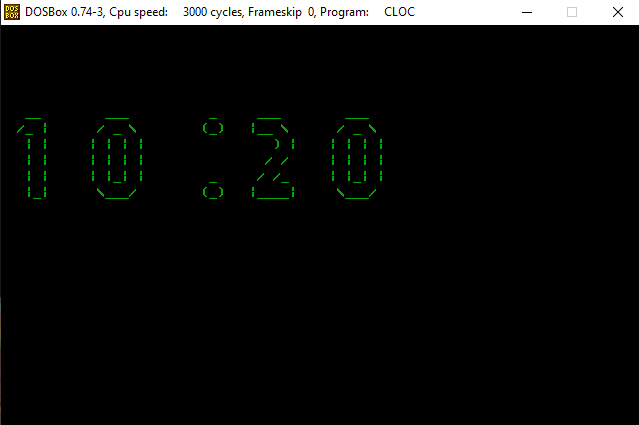

# Relógio 8086

## Introdução
Programa desenvolvido para *Arquitetura de Computadores II (FURB BCC)* com 8086 Assembly. 
Comportamento consiste em perguntar minutos e segundos (unidade + dezena) ao usuário e iniciar o funcionamento do relógio a partir desse horário.

## Avisos
- O foco do programa não foi aparência e sim funcionabilidade.
- Verificação de caracteres ASCII que não estão entre 48-57 funcionando apenas pelo **emu8086**.

## Emuladores/Compiladores
- **DOSBox**: emula um PC IBM que roda um sistema DOS. (https://www.dosbox.com/download.php?main=1)

- **emu8086**: usado para compilar assembly para um .exe. (https://emu8086-microprocessor-emulator.softonic.com.br/)

## Execução
- Montar a pasta com o executável

```
mount c: path/to/the/program
```

- Entrar na pasta
```
c:
```
- Rodar o programa
```
clock.exe
```
## Preview

